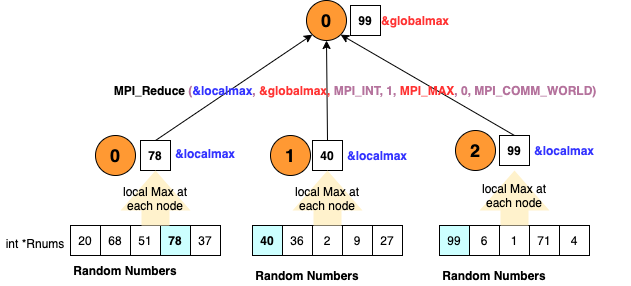

# MPI program to compute Max
This C program demonstrates how to use MPI (Message Passing Interface) to compute global Max. At a high level, each process generates 'n' number of random numbers, computes the local max, sends the max to root process (typicall process with id 0). The process 0 then computes the max (global) of all these local max numbers received from other processes (including its own local max). 

In the following example, there are 3 processes that compute max in parallel. Each process generates 5 random integers, and computes the local max. The three local max numbers (Process 0's max 78, process 1's max 40 and process 2's max 99) are sent to process 0 which then computes the global max (99 in this example) through an MPI reduction operation.   



Lets deep dive into the code. First, lets initialize the MPI library (`MPI_Init`), get the number of processes `p` (`MPI_Comm_size`), and the process identifier `pid` of the current process (`MPI_Comm_rank`).
```c
    MPI_Init(&argc, &argv);
    MPI_Comm_size(MPI_COMM_WORLD, &p);  
    MPI_Comm_rank(MPI_COMM_WORLD, &pid);
```
Note that the program's command line arguments (in this example, 'n' - number of integers to generate) are to sent each process by passing the command line (`&argc` and `&argv`) arguments to `MPI_Init` (as shown above).
`MPI_COMM_WORLD` is a special variable that references default group of communicators which is sufficient for basic MPI programming. 

Each process generates `n` number of integers and computes the local max using the code below (this is very basic for loop for computing max). 
```c
    int localmax=0; 
    srand((pid+1)*(unsigned) time(&t));
    for(int i=0;i<n;i++) {
        rnums[i] = rand() % 100;
        if (rnums[i] > localmax) 
            localmax = rnums[i];
    }
```
Next, each process sends its localmax to process 0 using `MPI_Reduce` with MPI_MAX as the reduction operator to compute global max. 
```c
    int globalmax = 0;
    MPI_Reduce(&localmax, &globalmax, 1, MPI_INT, MPI_MAX, 0, MPI_COMM_WORLD);
```
Lets look at the parameters of `MPI_Reuce` in detail below:
`MPI_Reduce(&sbuffer, &rbuffer, m, datatype, MPI_operation, root_process, MPI_COMM_WORLD);`

`&sbuffer` - pointer to the send buffer that holds, in our example, `localmax` computed by each process. This buffer is sent to the `root` process (process 0, in our example)
`&rbuffer` - pointer to the receive buffer that `root` process (process 0, in our example) will populate with global max value.  
`m` - number of elements of `datatype` present in the send buffer (`&sbuffer`) - in our example, each process sends one integer to `root` process.
`datatype` - MPI_INT for integer data type
`MPI_operation` - MPI_MAX since we want compute MAX
`root_process` - process id of the root process that will compute/receive the global max (in our case, it is process 0)
`MPI_COMM_WORLD` - default communicator

Now that process 0 has computed the global max and the buffer `&globalmax` is populated with max value, we print the global max to console. Since process 0 is the one that is computing global max, we should first check if the running process pid is 0, then print the variable `globalmax`;
```c
    if (pid==0) {
        printf("Global Max = %d\n", globalmax);
    }
```
# How to run this program
Now that we have understood how the code works, let us learn how to run this program. 
First, we will focus on testing the program locally (in this case, from MacOS machine locally). I will then show you how to run this in a multi-node cluster on AWS using `AWS Parallel Cluster`.

## Running the program using `mpirun` locally
Complete the following pre-requisites. 
1. Clone the repo https://github.com/babu-srinivasan/mpimax.git 
2. Install open MPI library (https://www.open-mpi.org/) on mac
   
   `brew install open-mpi`

I have provided a `Makefile` in the repo to compile the program. From the root directory of the repo, run `make`. This will compile the C program and generate the executable file in `bin/` directory. 


