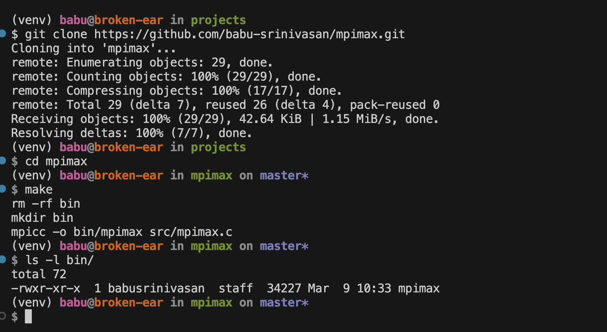
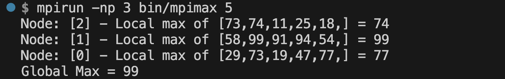
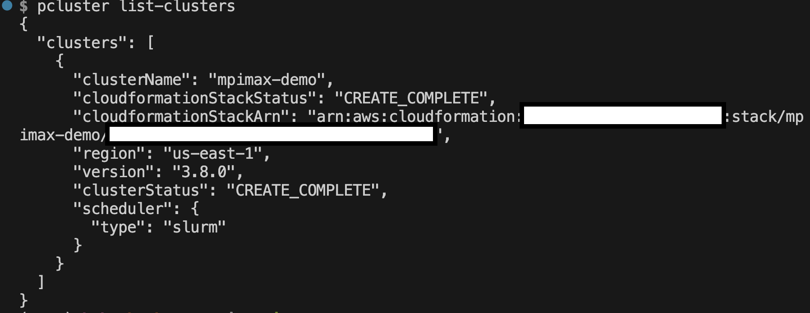
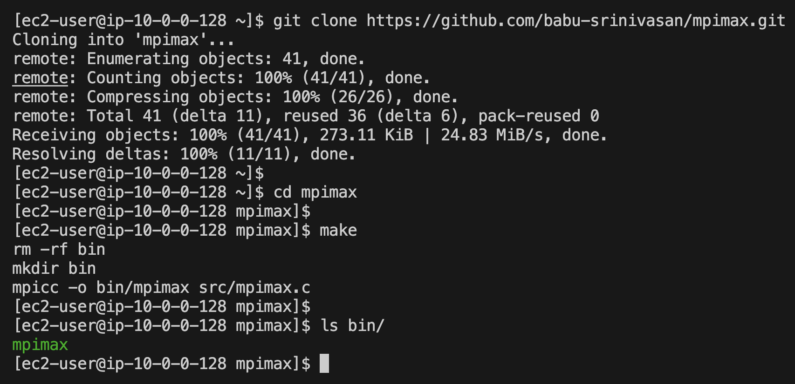
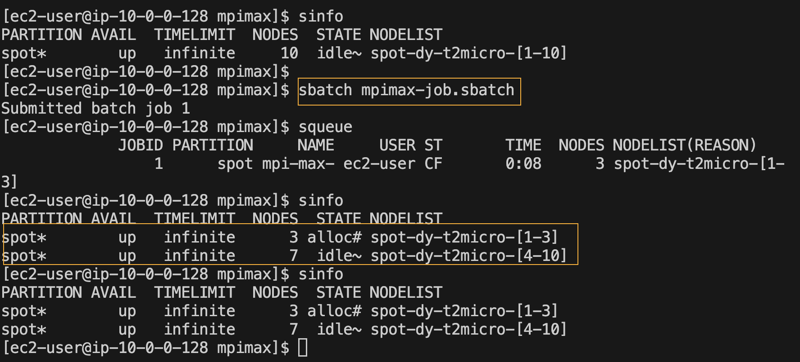

# MPI program to compute Max
This C program demonstrates how to use MPI (Message Passing Interface) to compute global Max. At a high level, each process generates 'n' number of random numbers, computes the local max, sends the max to root process (typicall process with id 0). The process 0 then computes the max (global) of all these local max numbers received from other processes (including its own local max). 

In the following example, there are 3 processes that compute max in parallel. Each process generates 5 random integers, and computes the local max. The three local max numbers (Process 0's max 78, process 1's max 40 and process 2's max 99) are sent to process 0 which then computes the global max (99 in this example) through an MPI reduction operation.   


Lets deep dive into the code. First, lets initialize the MPI library (`MPI_Init`), get the number of processes `p` (`MPI_Comm_size`), and the process identifier `pid` of the current process (`MPI_Comm_rank`).
```c
    MPI_Init(&argc, &argv);
    MPI_Comm_size(MPI_COMM_WORLD, &p);  
    MPI_Comm_rank(MPI_COMM_WORLD, &pid);
```
Note that the program's command line arguments (in this example, 'n' - number of integers to generate) are sent to each process by passing the command line (`&argc` and `&argv`) arguments to `MPI_Init` (as shown above).

`MPI_COMM_WORLD` is a special variable that references default group of communicators which is sufficient for basic MPI programming. 

Once the MPI is initliazed, each process generates `n` number of integers and computes the local max using the code below (this is very basic `for loop` for computing max value of an array of integers). 
```c
    int localmax=0; 
    srand((pid+1)*(unsigned) time(&t));
    for(int i=0;i<n;i++) {
        rnums[i] = rand() % 100;
        if (rnums[i] > localmax) 
            localmax = rnums[i];
    }
```
Next, to compute global max, each process sends its localmax to process 0 using `MPI_Reduce` with MPI_MAX as the reduction operator. 
```c
    int globalmax = 0;
    MPI_Reduce(&localmax, &globalmax, 1, MPI_INT, MPI_MAX, 0, MPI_COMM_WORLD);
```
Lets look at the parameters of `MPI_Reuce` in detail below:

`MPI_Reduce(&sbuffer, &rbuffer, m, datatype, MPI_operation, root_process, MPI_COMM_WORLD);`

> `&sbuffer` - pointer to the send buffer that holds, in our example, `localmax` computed by each process. This buffer is sent to the `root` process (process 0, in our example)
>
> `&rbuffer` - pointer to the receive buffer that `root` process (process 0, in our example) will populate with global max value. 
>
>`m` - number of elements of `datatype` present in the send buffer (`&sbuffer`) - in our example, each process sends one integer to `root` process.
>
>`datatype` - MPI_INT for integer data type
>
>`MPI_operation` - MPI_MAX since we want compute MAX
>
>`root_process` - process id of the root process that will compute/receive the global max (in our case, it is process 0)
>
>`MPI_COMM_WORLD` - default communicator

Now that process 0 has computed the global max and the buffer `&globalmax` is populated with max value, we print the global max to console. Since process 0 is the one that is computing global max, we should first check if the running process pid is 0, then print the variable `globalmax`;
```c
    if (pid==0) {
        printf("Global Max = %d\n", globalmax);
    }
```
# How to run this program
Now that we have understood how the code works, let us learn how to run this program. 
First, we will focus on testing the program locally (in this case, from MacOS machine locally). I will then show you how to run this in a multi-node cluster on AWS using `AWS Parallel Cluster`.

## Running the program using `mpirun` locally
Complete the following pre-requisites. 
1. Clone the repo https://github.com/babu-srinivasan/mpimax.git  
   
2. Install open MPI library (https://www.open-mpi.org/) on mac
   
   `brew install open-mpi`

Use the provided `Makefile` in the repo to compile the program using `mpicc` compiler. From the root directory of the repo, run `make`. This will compile the C program and generate the executable file `mpimax` in `bin/` directory. 



Run the program `bin/mpimax` using `mpirun`. For our use case, we will just use a basic form of `mpirun` without going into the environment/machine/host specific details. The basic form specifies number of processes to start and the name of the program to execute E.g. `mpirun -np 3 bin/mpimax 5`. 

`mpirun` parameters used in this example:

>`-np` parameter specifies number of processes to start, in this case `3`, 

> the name of the program executable (that we compiled in previous step) `bin/mpimax`. 
> In our example, the program `mpimax` also takes a parameter `n` - number random integers that each node should generate. 
> 

Sample output: 




## Running the program in a cluster using `AWS ParallelCluster`
Note: This option requires your own AWS account and you will incur charges for the resources you create in your AWS account. 

### Prerequisites
1. AWS Account
   
   Instructions for setting up an AWS account - https://docs.aws.amazon.com/parallelcluster/latest/ug/setting-up.html

2. AWS CLI installed and configured with AWS credentials
   
   Instructions for installing AWS CLI and configuring the credentials. https://docs.aws.amazon.com/cli/latest/userguide/getting-started-install.html

   If you don't want to configure CLI locally, you can use Cloud9 instance for all the CLI commands.
   Ensure that you can access the AWS resources in your AWS account from the terminal (either local MacOS or Cloud9). This is required for AWS Parallel Cluster CLI to deploy resources in your AWS Acount.

3. EC2 Key pair (existing or generate new) saved as `pem` file e.g. `mpilab.pem`
   
   Instructions for creating EC2 Keypair if you don't have one already setup https://docs.aws.amazon.com/parallelcluster/latest/ug/set-up-keypair.html


### Install, Configure and Create `AWS Parallel Cluster`
1. Install AWS ParallelCluster from the terminal - either on MacOS or cloud9.

`pip3 install "aws-parallelcluster" --upgrade --user`

`AWS ParallelCluster` Installation instructions: https://docs.aws.amazon.com/parallelcluster/latest/ug/install-v3-virtual-environment.html

2. To configure `AWS ParallelCluster`, run `plcuster configure --config config.yaml` from the command line. Refer to `https://docs.aws.amazon.com/parallelcluster/latest/ug/install-v3-configuring.html` for details on configuration parameters. 

You can also use the provided `config.yaml` file in `pcluster/` directory of the repo as the starting point. 

3. Create the cluster using the configuration file created above. 

`pcluster create-cluster --cluster-name mpimax-demo --cluster-configuration config.yaml`

4. You can list the clusters using the following command and check the `clusterStatus`. Once the cluster is created successfully, we will move to the next step of running our `mpimax` program in the cluster.

`pcluster list-clusters`




### Run `mpimax` program in the cluster

1. Before we can run the program, we should compile it in the head node of the cluster. So, lets first ssh to the head node using `pcluster ssh` command. The EC2 keypair created earlier will be used for ssh authentication, as shown below

`pcluster ssh --cluster-name mpimax-demo -i mpilab.pem`
 
2. Clone the repo https://github.com/babu-srinivasan/mpimax.git in the head node. Note that you may have to setup ssh key and use the ssh endpoint of the repo to clone.

3. From the root directory of the repo, run `make`. This will compile the C program and generate the executable file `mpimax` in `bin/` directory. 



4. To run the program, create a script that will be submitted to the scheduler as a batch job. I have provided a sample script `mpimax-job.sbatch` in the repo 

```sh 
#!/bin/bash
#SBATCH --job-name=mpi-max-demo
#SBATCH --ntasks=3
#SBATCH --output=mpimaxdemo.out
mpirun ./bin/mpimax
```

5. Submit the job to the queue using `sbatch` command to run the `mpimax` program on 3 different nodes (`-ntasks=3` parameter used in the script specifies the number of nodes to be started).

`sbatch mpimax-job.sbatch` 

6. Run `sinfo` command to check the status of the nodes. In this example, since we started 3 nodes, you will see 3 in allocated status and 7 in idle status (cluster was configured with 10 max nodes).



7.  Finally, to check the results, `cat` the output file e.g. `mpimaxdemo.out`, specified in the batch script.

Sample output: 

```sh
Node: [2] - Local max of [1,72,86,16,3,] = 86
Node: [1] - Local max of [73,90,29,2,76,] = 90
Node: [0] - Local max of [10,3,34,10,43,] = 43
Global Max = 90
```

### clean-up
Delete the cluster using `pcluster delete-cluster` command to stop incurring additional charges for the cluster you created for this demo in your AWS accunt.

`pcluster delete-cluster --cluster-name mpimax-demo`
